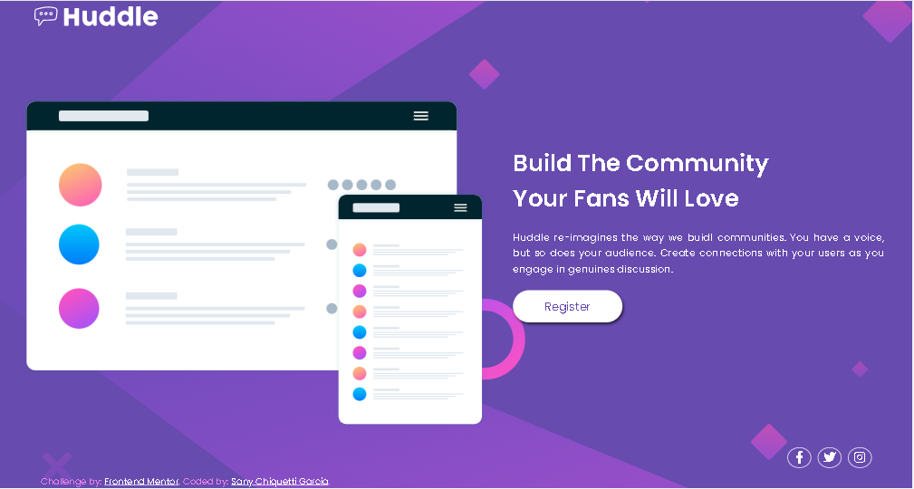
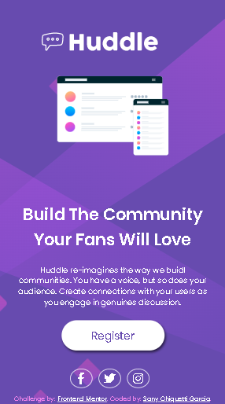

# Frontend Mentor - Huddle landing page with single introductory section

## Welcome! 👋

Thanks for checking out this front-end coding challenge.

[Frontend Mentor](https://www.frontendmentor.io) challenges help you improve your coding skills by building realistic projects.

**To do this challenge, you need a basic understanding of HTML and CSS.**

## The challenge

The challenge was to build that landing page from the designs provided in the starter code.
Where users should be able to:

Preview the ideal page layout depending on device screen size
See hover states for all interactive elements on the page

## See the result for the 1440px screen

<a>Huddly - desktop</a>

## See the result for the 375px mobile
<a>Huddly - desktop</a>

### Links

- Solution URL:('https://github.com/sanychiquetti/desafio-html-css')

- Live Site URL:('https://sanychiquetti.github.io/desafio-html-css/')
## My process

### Built with

- Semantic HTML5 markup
- CSS custom properties
- Flexbox
- CSS Grid
- Mobile-first workflow
- [Styled Components](https://styled-components.com/) - For styles

### What I've learned

In addition to knowing that I have a lot of hair, (because I pulled out several, in the responsiveness part 😂😂😂),  I was able to solve this challenge with the knowledge I have acquired with a lot of study, with the DevQuest frontend course!!!

In addition to developing HMTL and CSS, I also applied what I learned about the Atomic Design methodology and BEM methodology, where we managed to organize our project efficiently and easily maintained.

## How I developed this project
- In Html I used semantic tags, such as header, main, section and footer.
- In the CSS I used the flexbox to align the items on the screen, the responsiveness I used the media query.
- I imported the font link to my HTML: Open Sans and Poppins.
- I used Font Aweasome icons in my project, styling them to beautify my project.🤩

I know I'm still at the beginning, and I have a lot to improve, but I'm just getting started...😍😍😍

## Author

- Linkedim - [Sany Chiquetti Garcia](https://www.linkedin.com/in/sanychiquettigarcia/)
- Frontend Mentor - [@sanychiquetti](https://www.frontendmentor.io/profile/sanychiquetti)

## Acknowledgments

I thank Pablo Viana and Guga Silva - DevQuest Monitors, who gave all the necessary support, without giving ready answers, and all my classmates.

I hope you like it, and any suggestion for improvement will be welcome, as I am aware that my code, especially in terms of responsiveness, was not rounded.... But I'll get there!!!!